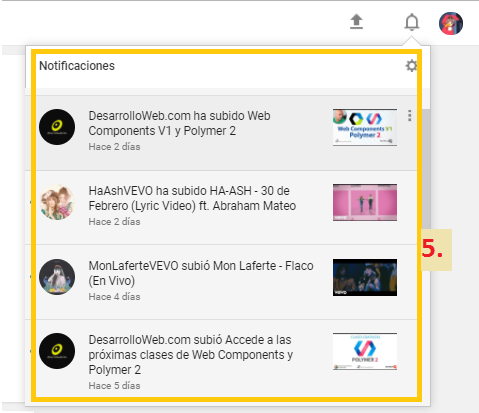
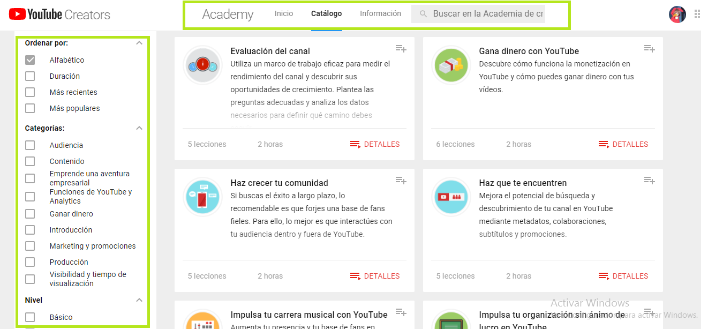

# UX Reto-01
* **Tema:**  _Intro a User Experience Design_

***
## Objetivo:
Explicar que partes conforman _UX_ y que partes un _UI_ de la página:
* [**YouTube**](https://www.youtube.com/)

***

### A)  _UX_: 

1. Poder configurar el video que se está visualizando, con diferentes tipos de opciones como el idioma, tipo de resolución, velocidad, etc.

2. Tener una series de configurciones para tu cuenta de youtube.

3. El menú desplegable con las opciones de inicio, tendencias, suscripciones, biblioteca, facilitando la busqueda de tus canles. 

4. Poder tener sugerencias de videos relacionados  a lo que se está visualizando, lo que se refiere la navegación contextual.

5. Recibir notificaciones de los videos nuevos subidos por los canales que se está suscripto.

6. Facilitar las configuraciones de idioma, ubicación, historial, ayuda o modo de restrincción, buscandolo en el footer.

7. Poder ver los videos más visitados de acuerdo a la ubicación en que se encuentre, esos son llamados _Tendencias_.

8. Visualizar tus videos _Favoritos_ guardados en tu cuenta.

9. Acceder a los _apps de youtube_.

10. Poder transmitir videos en vivo.

11. Tener acceso a unas series de cursos relacionados a las publicaciones, video subios para tu audiencia.

12. Tener la facilidad de omitir publicidades.

13. Suscribirse a canales con un solo botón.

14. Agregar valoraciones de _me gusta_  o _no me gusta_  a los videos visualizados.

15. Poder dar comentario de cada video.

***

### B)  _UI_: 

1. Diseño de iconos, de colores plomo.

2. Diseño del video y las images que se visulizan en la imagen.

3. Forma, tamaño y colores que se muestra en el _app para niños_.

4. Los filtros que se encuentra en el _app de YouTube Creators_.

5. La forma como se visualiza el video dentro de un _iphone_, llama la atención del usuario.

6. La forma del menú desplegable.

7. El tipo de color de fondo, hace que resalte más el video que se visualiza.

8. La forma de minis-videos que se localiza dentro del video principal.

9. Barra de avance del video.

10. El estilo, la forma y el color del buscador.

11. La forma circular del icono del usuario.

12. La forma circular de los iconos de suscripciones.

13. La forma descriptiva de cada suscriptor.

14. Fuente y color del icono suscripto.

